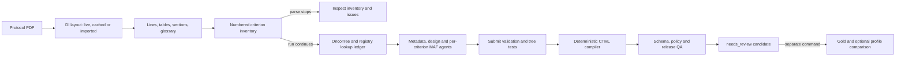

# Architecture

This page describes how the code turns a protocol PDF into a CTML candidate: the modules, the document lane, the registries, the agents and their checks, the compiler and the QA gate. The agents run in one of two layouts: the v5 supervisor workflow (default, see [Agent layout v5](#agent-layout-v5-the-supervisor-workflow)) or the compact layout.

## Module map

```
app/
  main.py                      FastAPI app (/health, /ctml/check, /ctml/runs)
  api/routes/ctml.py
  services/ctml/
    cli.py, __main__.py        python -m app.services.ctml run|parse|batch|check
    config.py                  Settings from environment variables (.env)
    pipeline.py                End-to-end run, run folder, resume; chooses the agent layout
    workflow.py                v5 supervisor workflow (Agent Framework): gates, fan-out, repairs, review routing
    merge.py                   v5: slot values joined into the structure; coverage comparison
    outcomes.py                Saved agent outcomes with input fingerprints; the agent runner
    text.py                    Markup cleanup and comparison keys (no meaning changes)
    document/
      di_parser.py             Document Intelligence call, cache, --di-json import
      model.py                 Lines (L1..), tables (T1..), running headers
      sections.py              Section tree, table-of-contents pages, routing
      inventory.py             Numbered eligibility criteria with population labels
      glossary.py              The protocol's own abbreviations
      segments.py              Several protocol documents bound in one PDF
    registries/
      http.py                  Retries, per-host limit, 7-day response cache
      ledger.py                Every lookup of the run, with lookup_id
      oncotree.py              OncoTree tree: search, hierarchy, solid or liquid
      ncit.py                  NCI Thesaurus search: drug, class or other
      hgnc.py                  HGNC symbols
      clinicaltrials.py        ClinicalTrials.gov v2 record
      terminology.py           The three searches the agents call
    schema/
      ctml.schema.json         UHN CTML schema (CTIMS catalog)
      loader.py                Enumerated values and validators
    contracts.py               What each agent submits
    tools/                     Agent tools: document, terminology, test_tree
    checks/                    Submit checks: criterion, design, metadata; v5: eligibility, slots,
                               coverage, resolver
    agents/                    Chat client, submit loop, instructions; metadata, design, criterion
                               (compact); v5: eligibility, specialist (clinical, genomics,
                               prior_therapy), coverage, resolver
    matching.py                Tree compilation and three-valued evaluation
    compiler.py                CTML assembly and text placement
    metadata_rules.py          Phase, dates, ClinicalTrials.gov merge
    qa.py                      Schema and policy checks, blocking issues, report
  tests/ctml/                  Offline tests (synthetic protocol, scripted model)
evaluation/                    Gold comparison and patient profiles (never imported by app/)
```

## End-to-end walkthrough

Run the CLI or API from the package root so `.env`, `pdfs/`, `runs/` and
`.cache/pmatch/` resolve locally. Only the evaluation command reads gold; it
never feeds the extraction pipeline. The document-processing steps are code and
Document Intelligence, not model-driven retrieval.



1. **Start a job.** `cli.py` loads `.env` from the current directory and builds
  `RunOptions`. `run` requires Foundry settings; `parse` can run without a
  model. `check` only reads a CTML; `batch` processes PDFs in order and reports
  failures individually. The HTTP route accepts a bounded PDF upload and
  starts the same pipeline as a background task. Every new run gets its own
  timestamped directory; a supplied existing `--run-dir` requests resume.
2. **Analyze the PDF.** `di_parser.py` uses Document Intelligence
  `prebuilt-layout` in markdown format. It caches by PDF checksum and analysis
  options, imports a supplied `--di-json`, or makes a fresh call with
  `--refresh-di`. The manifest records `document_intelligence` as `live`,
  `cache` or `import`, plus the PDF and DI page counts. A page-count mismatch
  is visible for review, not silently discarded.
3. **Build the source map.** `model.py` turns layout into page-located `L` lines
  and `T` tables (including paragraph boundaries). `segments.py` detects PDFs
  containing multiple versions; by default `pipeline.py` chooses the last
  segment with eligibility criteria, while `--pages` overrides it. `sections.py`
  routes current design, glossary and eligibility sections; `inventory.py`
  numbers/scopes criteria; `glossary.py` resolves abbreviations from this PDF.
  `parse` writes `document/` and the manifest, then stops here: no registry,
  model call, CTML or gold read.
4. **Check the inventory before live extraction.** Open `document/inventory.md`
  alongside the PDF and check each ID, population, page, list item, `Issues`
  and `Group titles`. Schema validation later cannot recover text already
  dropped here. `criterion_text_unfinished`, missing criteria and repeated
  numbering block release; a connective mistaken for a title changes meaning.
5. **Load registries and run agents.** OncoTree loads once; NCIt and HGNC
  searches are on demand, and ClinicalTrials.gov cross-checks metadata when
  available. `lookups.jsonl` records actual candidates, owner and lookup ID.
  A semaphore limits concurrent metadata, study-design and per-criterion
  agents. Each agent reads with bounded tools and calls `submit_*`; its checks
  reject invalid form/lineage or request a quoted confirmation. Accepted
  submissions are saved under `agents/` for resume. `--criteria` runs only
  selected criteria and marks the result `partial_run`.
6. **Assemble and review.** `metadata_rules.py` prefers sourced PDF values and
  records registry conflicts. `compiler.py` joins applicable criterion trees
  to each design arm and places residual source text according to the
  category policy. `qa.py` checks the CTML schema, shape and release blockers
  and writes `qa_report.json` and `qa_report.md`. Status is always
  `needs_review`, even with no blocking issues. An accepted criterion may be
  partially structured, text-only, or omitted by policy; inspect
  `evidence.json`, not only the accepted count.
7. **Evaluate separately.** `python -m evaluation.compare` compares an
  already-written candidate against user-supplied gold and optionally patient
  profiles. It writes a Markdown and JSON report when `--out` is specified.
  With no profiles it makes no registry requests. Exact leaf overlap counts
  duplicate leaves across arms; different arm structures or gold spelling
  may change the score without changing clinical meaning. Profiles are
  non-gating until a reviewer validates their expectations and sources.

## Script reference

Paths are relative to this package root. The existing module map above shows
where the files live; this table explains what each executable Python module
actually owns. `__init__.py` files mark packages and have no independent run
step. None of the document-lane modules calls an LLM.

| Module | Responsibility and handoff |
|---|---|
| `app/main.py` | Loads local `.env` for Uvicorn, registers the CTML router and exposes `/health`. |
| `app/api/routes/ctml.py` | `POST /ctml/check` checks schema/policy; `POST /ctml/runs` saves a PDF (200 MB cap) and schedules `run_pipeline`; `GET /ctml/runs/{name}` polls saved QA. API background execution is not a job queue or hosted Foundry agent. |
| `app/services/ctml/__main__.py` | Calls the CLI's `main()` for `python -m app.services.ctml`. |
| `app/services/ctml/cli.py` | Parses `parse`, `run`, `batch` and `check` flags; loads `.env`, summarizes runs, invokes the pipeline or validates an existing CTML. `check` does not contact Azure. |
| `app/services/ctml/config.py` | Parses endpoints, auth, timeouts, run/cache folders and category omissions; `public_view()` removes keys from the manifest. Empty keys select Entra ID. |
| `app/services/ctml/pipeline.py` | Allocates a unique run directory, checks PDF/page compatibility on resume, assembles the document, loads registries, runs agents concurrently, compiles CTML and writes QA and evidence. `parse` returns before registry/model work. |
| `app/services/ctml/runtime.py` | Holds per-run document/registry context and per-agent state; `ToolRecorder` writes bounded tool argument/result records to `tool_calls.jsonl`. |
| `app/services/ctml/text.py` | Cleans layout markup and supplies formatting/comparison keys; does not infer clinical meanings. |
| `app/services/ctml/metadata_rules.py` | Chooses protocol-first metadata with registry fallbacks, records disagreements, converts phase to Roman numerals and dates from Toronto midnight to UTC. |
| `app/services/ctml/contracts.py` | Typed metadata, study design, criterion, match-tree and example-patient submissions consumed by tools, checks and the compiler. |
| `app/services/ctml/matching.py` | Compiles nested AND/OR/leaf trees, hashes drafts and evaluates them with true/false/not-evaluable results; also powers agent `test_tree` and profile scoring. |
| `app/services/ctml/compiler.py` | Merges accepted scoped trees and arms, creates stable arm UUIDs, places residual criteria by policy and records evidence; never rewrites generated CTML using gold. |
| `app/services/ctml/qa.py` | Checks JSON Schema and output policy, separates blocking from review-only issues and renders both QA reports. `needs_review` is never equivalent to clinical approval. |
| `app/services/ctml/document/di_parser.py` | Calls DI `prebuilt-layout` in markdown; checks imported layout, hashes PDFs, counts pages and stores/reuses results by PDF/options checksum. |
| `app/services/ctml/document/model.py` | Builds page-located line IDs, paragraph starts, table IDs/cells and repeated running-header/footer markers from DI layout. |
| `app/services/ctml/document/segments.py` | Detects repeat table-of-contents boundaries in bound protocols; validates an explicit `--pages` range. The pipeline chooses the last eligible segment by default. |
| `app/services/ctml/document/sections.py` | Forms a section tree, demotes list items misread as headings, excludes TOC/history and routes design, glossary and eligibility regions. |
| `app/services/ctml/document/inventory.py` | Splits numbered/bulleted criteria, scopes population alternatives, links tables and reports gaps, group titles and unfinished text. Inspect before agent calls. |
| `app/services/ctml/document/glossary.py` | Extracts case-sensitive abbreviations from protocol tables, lines and aligned inline definitions, reporting conflicts. |
| `app/services/ctml/registries/http.py` | Limits and retries external requests and optionally caches registry responses for seven days. |
| `app/services/ctml/registries/ledger.py` | Appends owner-bound query results with `lookup_id`, candidate list and live/cache/error origin for tool lineage. |
| `app/services/ctml/registries/oncotree.py` | Loads and searches tumor hierarchy, including solid/liquid tissue and ancestry used for diagnosis lookups. |
| `app/services/ctml/registries/ncit.py` | Searches NCI EVS concepts, synonyms, parents and `drug`/`class`/`other` classifications for prior therapy. |
| `app/services/ctml/registries/hgnc.py` | Resolves approved gene symbols and aliases through HGNC. |
| `app/services/ctml/registries/clinicaltrials.py` | Finds an NCT ID in front matter/name and retrieves the ClinicalTrials.gov v2 record for metadata verification/fallback. |
| `app/services/ctml/registries/terminology.py` | Combines OncoTree, NCIt, HGNC, glossary and ledger into the three criterion-agent search methods. |
| `app/services/ctml/schema/loader.py` | Loads packaged CTML JSON Schema, derives enum literals for Pydantic and reports bounded leaf or whole-document errors. |
| `app/services/ctml/schema/ctml.schema.json` | CTML shapes, enums and leaf constraints; not an executable script but the output contract. |
| `app/services/ctml/agents/client.py` | Constructs the MAF `OpenAIChatClient` on the Foundry OpenAI v1 endpoint with key/Entra auth and function-invocation limits. |
| `app/services/ctml/agents/loop.py` | Runs agents with tool middleware, retries and reminders; stops on accepted submit and honors reasoning effort and agent timeout. |
| `app/services/ctml/agents/instructions.py` | General metadata, design and criterion instructions, including representable/full/partial/none and source/lookup requirements. |
| `app/services/ctml/agents/metadata.py` | Supplies front-matter evidence and document tools; accepts cited `MetadataSubmission`. |
| `app/services/ctml/agents/design.py` | Ranks synopsis/design/treatment sections; submits protocol-supported drugs, arms, populations and doses. |
| `app/services/ctml/agents/criterion.py` | Runs one specialist agent per selected criterion with document, terminology and tree-test tools; submits tree and unmapped items. |
| `app/services/ctml/tools/document.py` | Bounded page, line, section, table, phrase and abbreviation reads, including source line IDs for citations. |
| `app/services/ctml/tools/terminology.py` | Exposes `search_diagnosis`, `search_therapy` and `search_gene` and remembers agent-owned lookup IDs. |
| `app/services/ctml/tools/tree.py` | Implements `test_tree` against source-backed example patients; tests the draft's exact hash before submission. |
| `app/services/ctml/checks/common.py` | Shared reject/confirm envelopes and quote-based confirmation handling. |
| `app/services/ctml/checks/metadata.py` | Requires metadata values and dates/phase to be sourced and properly distinguished from labels or versions. |
| `app/services/ctml/checks/design.py` | Validates design quote/line IDs, drug and dose provenance, arm uniqueness and population scopes. |
| `app/services/ctml/checks/criterion.py` | Validates leaf structure, source quotes, lookups, schema, listed-item citations, tested tree and reviewable patterns; cannot prove clinical meaning. |
| `evaluation/compare.py` | Loads an already-generated CTML and supplied gold, compares metadata/arm names/literal leaves/additional texts, and optionally scores patient profiles; writes `.md` and `.json` with `--out`. |

The offline test scripts under `app/tests/ctml/` mirror the layers:
`test_document.py` covers routing/criteria and synthetic DI layouts;
`test_registries.py` tests stubbed clients/ledger; `test_agent_loop.py` tests
submission/retry; `test_checks.py` tests source/contract enforcement;
`test_matching.py` tests patient-tree behavior; `test_compiler.py` tests CTML
assembly; `test_interfaces.py` tests CLI/API/config; and
`test_pipeline_offline.py` exercises the whole pipeline with no Azure.
`synthetic.py`, `fake_model.py` and `conftest.py` provide fixtures and a
scripted client. `evaluation/tests/test_compare.py` uses synthetic documents
and profiles, not client gold files. `requirements.in` contains direct pins,
`requirements.txt` is the compiled dependency set, and `pyproject.toml`
configures pytest and Ruff.

## Files produced, and how to trace an answer

Each `run` and `parse` creates a distinct `runs/<pdf-stem>-<UTC-time>-<suffix>/`.
Do not edit a generated candidate to match gold, overwrite a previous run or
reuse accepted model answers after changing instructions. The pipeline creates
`runs/` when needed; Git ignores that whole directory. Files below are
relative to one run folder.

| File | Produced when | Questions it answers |
|---|---|---|
| `manifest.json` | Every parse/run | Which PDF checksum, DI source (`live`/`cache`/`import`), DI options, selected pages, model, call counts and start/finish time? Public settings omit keys. |
| `run.log` | Every parse/run | Which operation failed, or which agent accepted/failed? Review before retrying; no model reasoning or key values should be copied into a report. |
| `document/lines.json` | Every parse/run | What was the exact source line (`L...`), page, DI kind and `paragraph_start`? |
| `document/tables.json`, `routing.json`, `glossary.json` | Every parse/run | What did DI read as a table, which section was routed, and which abbreviation definition was used? |
| `document/inventory.json`, `inventory.md` | Every parse/run | Were all printed criteria, IDs, scopes, text, group titles and references captured? Issues here must be reviewed before agents run. |
| `registry/oncotree_tumor_types.json`, `lookups.jsonl` | Full run | Which hierarchy and exact registry candidates did a criterion agent actually see, with what owner and lookup ID? |
| `tool_calls.jsonl` | Full run | What document/registry/tree/submit tools were called, with bounded result text? May contain protocol content: keep local. |
| `agents/metadata.json`, `agents/design.json`, `agents/criteria/<ID>.json` | Full run | Which submissions passed, which confirmations or failures occurred, and which accepted answer can resume reuse? |
| `evidence.json` | Full run | For each criterion, what text/page, representability, tree leaves, exact quote, lookup IDs, unmapped items and text-placement policy led to the candidate? |
| `<trial-id>_CTML.json` | Full run if design accepted | Which executable leaves, study arms, dose levels and additional texts are proposed for human review? Partial runs also write CTML; check `partial_run` in QA. |
| `qa_report.json`, `qa_report.md` | Full run | What blocked release, what still needs review, and how many accepted criteria were full, partial, or unstructured? `needs_review` alone does not mean unblocked. |
| `comparison.md`, `comparison.json` | Separate evaluation command | Where did the candidate differ from supplied gold? Never inputs to extraction. No report is produced automatically by `run`. |

To investigate one suspected leaf, start with the criterion row in
`document/inventory.json`; use its line IDs in `document/lines.json` and
linked table IDs in `document/tables.json`. Check the agent's accepted
submission in `agents/criteria/`, then the compiled leaf, exact
`source_concept`, lookup IDs and residual text placement in `evidence.json`.
Look up those IDs in `lookups.jsonl`, and confirm the displayed value and
negation in CTML. Check `qa_report.md` for blocking versus review-only issues.
Only *after* this source check should `evaluation.compare` use gold; a gold
spelling, different arm granularity or class/name convention is not a reason
to overwrite the source-supported candidate.

Important limits of the checks: a submit check proves that a value was
returned by an owner-scoped tool and cited source lines; `test_tree` checks
only the example patients the agent supplied. Neither proves that every
permitted exception is represented, that an OncoTree subtype is broad enough,
or that gold's arm structure matches the protocol. An accepted criterion can
have `representable: none`, and policy may omit its text from CTML even though
the audit evidence retains it. Review potential false-positive matching risks
(missing exclusions) separately from false-negative risks (extra exclusions).

PDF contents under `pdfs/` (but not its empty `.gitkeep` marker), `runs/`,
`CTMLs/`, `.cache/`, private `.env`, local client `evaluation/gold/` and local
`evaluation/profiles/` are ignored by Git.
`CTMLs/` is a manually curated copy of **full** CTMLs, not a pipeline output
or publication target. Place gold under `evaluation/gold/` locally, or pass an
absolute `--gold` path; the evaluation tests supply synthetic gold themselves.

## Document lane (code only)

The document lane has three parts: lines, sections and routing, and criteria.

**Lines.** `model.build_document` splits the Document Intelligence markdown into lines.

- Every line gets a run-wide ID (`L1`, `L2`, …) and a page number, taken from the page spans.
- A table becomes one placeholder line (`[Table T3] caption`) plus a cell grid.
- Markup is removed: HTML tags that Document Intelligence writes, markdown escapes and LaTeX formulas. Comparison signs such as `<100` stay.
- Running headers and footers are kept once, where they first appear, as kind `running`. They can hold header fields such as the protocol number, but they never join a criterion.
  - A header or footer is a text named in a `PageHeader` or `PageFooter` comment, or a text repeated at the top or bottom of at least 30% of pages.
  - A line at the top or bottom edge of a page that is a whole-word part (at least 8 letters) of such a header is running text too. Document Intelligence sometimes splits a two-line header into two lines, and the parts would otherwise join the criterion that continues on that page.
- `lines.json` records for each line whether it starts a paragraph (`paragraph_start`). Document Intelligence keeps the printed line breaks inside a paragraph.

**Sections and routing.** `sections.route` builds the section tree from the headings.

- Headings on table-of-contents pages are ignored.
- A numbered heading that breaks the document's numbering order is demoted to text. Document Intelligence sometimes marks list items as headings.
- History blocks are marked historical and never routed. Examples: summary of changes, revision history.
- Eligibility regions are sections whose titles name inclusion, exclusion or eligibility **and** criteria (or eligibility).
  - An outer "Eligibility" section holding "Inclusion" and "Exclusion" subsections yields the subsections.
  - A synopsis copy of the key criteria is skipped when the full criteria exist, and this is reported.
- Design sections are synopsis, design and treatment sections. The design agent reads them in this order: synopsis, then design, then treatment. Rationale and statistics sections come last.

**Criteria.** `inventory.build_inventory` reads each eligibility region.

- Markers: `1.`, `1)`, a number glued to the text, and a margin number on its own line. A list printed only with bullets uses its top-level bullet as the marker, and the criteria are numbered in order.
- Short title lines ("Medical Conditions") start a new group when a numbered item follows.
  - Inside an open list ("any of the following:"), a title line labels bullets of that list and stays in the criterion.
  - A title must stand on its own. Document Intelligence keeps the printed line breaks inside a paragraph, and a line inside a paragraph is never a title.
  - A line that finishes an unfinished sentence stays in its criterion, even when it is short, capitalised or marked as a heading. Unfinished means a bracket left open, or a last line that ends with a hyphen, comma, slash or a word such as "see", "and" or "of". A line that closes a bracket it never opened ("Section 6.3.1)") is a continuation too. This covers sentences that continue on the next page.
  - The lines read as titles are listed under "Group titles" in `inventory.md`, where a misread line is easy to see.
- Population labels come from three places:
  - a leading "Part 2:" or "Cohort A:" in the item;
  - lettered alternatives, which are split into `INC-5.1`, `INC-5.2`, …;
  - a heading or title line that names a population.
- A later heading at the same level that names no population ends the scope.
- A table the criterion refers to ("as defined in Table 7") is linked.
- Issues are reported: numbering gaps, unnumbered items, repeated numbers, criterion texts that end unfinished, no inclusion or no exclusion criteria, and bullet lists. Some of them block (see QA).

**Glossary.** `glossary.build_glossary` reads the protocol's own abbreviations.

- Tier 1: rows of two-column glossary tables and glossary lines.
- Tier 2: inline "long form (SF)" definitions whose letters align, within one clause.
- A table row next to a half-empty row is not trusted (shifted rows are common in scanned glossaries).
- Keys are case-sensitive.

**Several documents in one PDF.** `segments.find_segments` looks for a table of contents that appears again after at least 20 pages.

- The run uses the last segment that has eligibility criteria and reports the choice.
- `--pages` overrides the choice.

## Registries

Every lookup is written to `lookups.jsonl` with a `lookup_id`, the query, the candidates, the owner (criterion ID) and the source (`live`, `cache` or `error`). A leaf must cite the lookups its values came from, and only lookups of its own criterion count.

- **OncoTree:**
  - The whole tree is loaded once per run and saved in the run folder.
  - Search is word overlap between the query and each node's name, main type and code. When the query is an abbreviation the protocol defines, its definition is searched too.
  - When no name fits well, the query goes through NCIt ("bridge"). An OncoTree node is offered only if its NCI code equals the NCIt concept found, or its name equals that concept's name or a synonym.
  - A code match that contradicts the protocol's own definition of the same abbreviation is flagged.
  - "Liquid" means the OncoTree tissue Lymphoid or Myeloid, as MatchMiner defines `_LIQUID_`.
- **NCIt:** EVS REST search with synonyms, parents and properties. The kind comes from NCIt's own properties:
  - `class`: a concept with a drug-class semantic type ("Chemical Viewed Functionally", "Chemical Viewed Structurally" or "Classification") and no substance code (FDA UNII, CAS or NSC). The NCI Drug Dictionary lists many classes (for example the targeting-agent, agonist and antibody classes), so its ID alone does not make a concept a drug;
  - `drug`: a single substance: a substance code or an NCI Drug Dictionary ID, or the semantic type "Pharmacologic Substance";
  - `other`: genes, proteins, diseases, procedures and the rest.
- **HGNC:** the approved symbol, then the alias, then the previous symbol.
- **ClinicalTrials.gov:** fills metadata gaps and cross-checks it. The protocol comes first.
  - The site's firewall refuses some HTTP clients (HTTP 403). After a 403, the request is repeated once with the Python standard-library client, and the answer is cached like any other.
  - The arm and intervention descriptions become citeable lines `R1`, `R2`, …. Only the design agent reads them (`read_registry_record`), and only for a dose the protocol redacts or does not state.

## Agents

All agents share one loop (`agents/loop.py`).

1. The first message holds the input.
2. The agent reads with its tools and calls its submit tool.
3. The submit tool runs the checks and returns `accepted`, or errors to fix with `code`, `path` and `hint`.
4. A function middleware ends the loop after the accepted submit.
5. If a run ends without an accepted submit (a model can answer in text once `tool_choice` "required" has been used), the same session gets one reminder.
6. On rate limits and connection errors, the agent restarts with fresh tools, twice, after 20 and 60 seconds.
7. Tools are async and built per attempt. No state crosses agents or attempts.

Run options: `tool_choice` "required", `store` false (the framework keeps the history and replays encrypted reasoning), and the optional reasoning effort. The function-invocation settings are:

- `include_detailed_errors`: argument errors, such as a value outside an enum, reach the model with the allowed values;
- `max_iterations`: 30;
- `max_function_calls`: 80;
- `max_consecutive_errors_per_request`: 5 (a failed argument check counts as an error; a rejected submit does not).

| Agent | First message | Tools | Submits |
|---|---|---|---|
| Metadata | The first pages of the document, with line IDs | `read_pages`, `read_lines`, `read_section`, `get_table`, `find_in_protocol`, `define_term` | `MetadataSubmission`: each field is a value plus line IDs |
| Study design | Outline with section IDs; the population labels the criteria use; design sections up to 60,000 characters | the same document tools, `read_registry_record` | `DesignSubmission`: design type with quote, drugs, arms with scope labels and dose levels |
| Criterion (one per criterion) | Criterion ID and kind, population, section, list stem, lines, listed sub-items, referenced tables, the protocol's definitions of its abbreviations | document tools, `read_context`, `search_diagnosis`, `search_therapy`, `search_gene`, `test_tree` | `CriterionSubmission`: representable (full, partial or none), tree, unmapped items, context category, review notes |

A criterion tree has two node types:

- **Groups** (`type` "and" or "or") hold items.
- **Leaves** (`type` "leaf") hold exactly one of `clinical`, `genomic` or `prior_treatment`, plus:
  - `source_concept`: the exact words the leaf encodes;
  - `line_ids`;
  - `lookup_ids`.

Enumerated fields are typed from the schema. Stage and TNM fields are not offered (reviewer rule).

The table above is the compact layout. The v5 layout replaces the criterion agent with the agents of the next section; the metadata and study design agents are the same in both.

## Agent layout v5: the supervisor workflow

`PMATCH_AGENT_LAYOUT=v5` (the default) follows the agent split of architecture v5. `workflow.py` builds one Microsoft Agent Framework workflow per run:

- The **supervisor** is an executor written in code. It owns the run: dependency gates, fan-out per criterion, bounded repairs and review routing. The model never chooses the next step.
- Each **agent kind** is an executor. It runs its agent for every job of a task at the same time, under the run's limit (`PMATCH_MAX_PARALLEL_AGENTS`), and returns the outcomes to the supervisor. Messages always go from the supervisor to one executor and back (hub and spoke).

| Step | Done by | Waits for |
|---|---|---|
| 1 | Metadata, study design and the coverage checker (one listing per criterion) | nothing |
| 2 | Eligibility logic agent, one per criterion | the study design: it needs the arms and their population labels |
| 3 | Structure gate (code): the structure is compared with the coverage listing; a criterion with omissions goes back to the eligibility logic agent with the omitted words | the criterion's structure and coverage listing |
| 4 | Clinical, genomics and prior therapy agents fill the slots of their domain | the gate |
| 5 | Merge (code, `merge.py`) | the criterion's domain agents |
| 6 | Resolver: audits the compiled candidate once; "repair" findings send their criteria through steps 2 to 5 once more, with the finding as a note | every criterion, the metadata and the design |
| 7 | Compile and QA gate (code, `pipeline.py`) | the workflow's outcome |

| Agent | First message | Tools | Submits |
|---|---|---|---|
| Eligibility logic | The criterion (as for the compact criterion agent), the arms with their population labels, and a repair note when the supervisor sends the criterion back | document tools, `read_context`; no registry search | `EligibilitySubmission`: representable, logic (AND / OR groups of slots), unmapped items, context category, examples |
| Clinical, genomics, prior therapy | The criterion, the structure and the slots of the agent's domain, and a repair note when there is one | document tools, `read_context`, and only the agent's own search (`search_diagnosis`, `search_gene` or `search_therapy`) | One fill per slot: the positive registry values with their lookup IDs (one value, or several when no single registry entry covers the words), or `cannot_map` with the reason |
| Coverage checker | The criterion and the tables it refers to; never the structure | none besides `submit_coverage` | Every condition with its exact words and kind: requirement, exception, example or note |
| Resolver | The compiled candidate in words: a reading guide, trial details, arms with dose levels, population labels and the arm's combined rule, every criterion with its text, rule, text items and placement | document tools | Issues: target (criterion ID, `design` or `metadata`), action (`repair` or `review`), problem, quotes, line IDs |

**Slots and polarity.** A slot is one condition CTML can hold: slot ID, domain (`clinical`, `genomic` or `prior_treatment`), the exact words, line IDs and `negated`. Polarity belongs to the structure. The domain agents give positive values, and a value with "!" is rejected (`negation_in_value`). Code writes the exclusion (`merge.apply_negation`): "!" before a diagnosis, drug, drug class or transplant type; the opposite age rule (`<18` for an excluded `>=18`); `!Mutation`; a negated copy-number call. A negated condition the schema cannot state (a treatment category alone, a structural variant, `_SOLID_` or `_LIQUID_`) is refused at the fill (`cannot_exclude`) and stays as text.

**Several values.** A fill normally has one value. Words that no single registry entry covers (a cancer of several organs, an inhibitor of two targets) get several values: any of them satisfies the slot (an OR), and a negated slot excludes each of them (an AND of exclusions). One disease named in several sites ("colon or rectum") is one slot, and the clinical agent prefers the one node that covers it. Every value is checked as its own leaf.

**Examples.** The eligibility logic agent describes example patients by the slots they have. Code evaluates them on the logic (`merge.evaluate_logic`) and rejects a structure that disagrees with its own examples. This replaces `test_tree` of the compact layout.

**Checks.** `checks/eligibility.py` holds the structure, quote, sub-item coverage, polarity and exception checks of the compact layout. `checks/slots.py` checks each fill as the leaf it becomes, with the compact registry checks: a value must come from a search of the same agent (`lookup_ids` owned by `<ID>/<agent>`), copied exactly, of the right kind. `checks/coverage.py` and `checks/resolver.py` require exact quotes.

**Merge.** Code joins the fills into the structure by slot ID (`merge.merge_criterion`). A slot without a value (`cannot_map`, or a domain agent that did not finish) is never guessed: it becomes an unmapped item and the encoding becomes partial, with a review item (`slot_not_encoded:`). Inside an AND the other conditions stay: the rule then admits more patients, never fewer. Inside an OR the alternatives CTML can hold stay and the others go to text, with a review item (`or_alternative_not_encoded:`), as in the UHN gold files (C26, revised 10/06). An OR of excluded conditions (an excluded combination) is never split: dropping one part would exclude more patients than the protocol does, so it goes to text. QA lists an arm whose rule requires no diagnosis (`arm_without_diagnosis:`), and blocks an arm that requires a diagnosis and excludes a diagnosis covering it (`arm_contradiction:`), because no patient can match it.

**Coverage comparison.** A requirement or exception of the coverage listing is covered when at least half of its characters fall inside a slot's words or an unmapped item. Omissions send the criterion back to the eligibility logic agent once (`PMATCH_MAX_REPAIR_ROUNDS`, default 1). An omission still there after the repair is listed for review (`coverage_omission:`); the structure is not changed.

**Resolver.** Every finding must quote its cited lines. A `repair` finding on a criterion sends that criterion back once (at most 10 criteria): the eligibility logic and domain agents run again with the finding as a note. A changed encoding is listed for review (`resolver_repaired:`); an unchanged one as `resolver_finding_not_adopted:`. If the repair is not accepted, the earlier encoding is kept (`resolver_repair_not_accepted:`). Findings on the design or the metadata, and `review` findings, go to the review list (`resolver:`). `PMATCH_RESOLVER=0` turns the resolver off.

**Files.** `agents/metadata.json`, `agents/design.json`, `agents/coverage/<ID>.json`, `agents/eligibility/<ID>.json`, `agents/clinical|genomics|prior_therapy/<ID>.json`, `agents/resolver.json` and `agents/resolver_view.md`. A repeated run of a criterion is saved as `<ID>.attempt2.json`. `evidence.json` adds, per criterion, the structure, every eligibility logic run, the coverage listing, the omissions left, the fills and the slots kept as text (`workflow`); and for the run the timeline, the repairs and the resolver findings (`workflow`). `qa_report.md` has a section on the workflow.

**Not built.** The workflow runs in-process; it is not hosted in Microsoft Foundry. The service has no approve, return or hold step: every result is `needs_review` and a person reviews the QA report. Agent Framework checkpoint storage is not used: the agent outcomes saved with a fingerprint of their input serve as checkpoints (see resume below).

## Checks

Reject: the agent must change the output. Confirm: the agent changes the output, or resubmits with `{code, path, quote}`, where the quote has at least three words from the criterion itself. Confirmed patterns go on the review list.

**Criterion checks**

| Code | Kind | Rule |
|---|---|---|
| `missing_tree`, `tree_with_none`, `full_with_unmapped`, `partial_without_unmapped` | reject | `representable`, the tree and the unmapped items agree |
| `unmapped_quote_not_in_source` | reject | Unmapped items quote the source |
| `leaf_kind`, `empty_leaf` | reject | A leaf holds exactly one filled kind |
| `source_concept_not_in_source` | reject | Exact words of the criterion, its tables, its abbreviation definitions or lines a tool returned |
| `unknown_line_id`, `leaf_not_in_criterion` | reject | A leaf cites existing lines, at least one of them the criterion's own (or one of its tables) |
| `leaf_schema` | reject | The compiled leaf passes the CTML leaf schema, including its if/then rules |
| `unknown_lookup_id`, `value_not_from_lookup`, `name_not_exact` | reject | Every registry value (diagnosis, gene, drug, class) was returned by a lookup of this criterion and is copied exactly |
| `agent_is_class`, `agent_class_is_drug`, `agent_class_not_a_drug_class` | reject | `agent` is a drug concept; `agent_class` is a class concept or a parent class of a returned drug |
| `negated_sentinel` | reject | No `!_SOLID_` or `!_LIQUID_` |
| `list_item_not_covered` | reject | Every listed sub-item is cited by a leaf or by an unmapped item |
| `tree_not_tested`, `test_disagreement`, `test_incomplete` | reject | `test_tree` ran on this exact tree (same hash) with an eligible and a not-eligible patient that agree, and no disagreement |
| `exclusion_without_negation` | confirm | An exclusion tree with no negated value |
| `inclusion_with_negation` | confirm | An inclusion with a negated value |
| `exclusion_or_of_negations` | confirm | In an exclusion, an OR of negated leaves. This fits a combination, not "any of". |
| `inclusion_or_mixed_diagnosis` | confirm | An OR mixing a negated diagnosis with positive ones |
| `sentinel_beside_diagnoses` | confirm | `_SOLID_` or `_LIQUID_` in an OR with specific diagnoses |
| `category_only_in_partial` | reject | A prior-treatment leaf with only `treatment_category` in a partly encoded criterion: the text kept aside (counts of lines, alternatives, exceptions) makes the leaf unfaithful |
| `category_only_leaf` | confirm | A prior-treatment leaf with only `treatment_category` in a fully encoded criterion |
| `negation_with_open_exception` | reject | In an exclusion, a negated leaf shares lines with an unmapped exception ("unless", "except", "other than", "... is allowed"): the negation would also exclude the patients the exception keeps. A case-by-case waiver (sponsor or medical monitor approval) does not count. |
| `exclusion_exception` | confirm | An exclusion whose text states an exception has negated leaves. Confirm when the registry hierarchy keeps the allowed items out of the negated class. |
| `tissue_level_diagnosis` | confirm | A positive diagnosis at OncoTree level 1 (a tissue, such as "Breast"): it covers in situ and benign tumors too |
| `tree_for_optional_substudy` | reject | A criterion of an optional sub-study has no tree |

**Design checks**

- Reject:
  - `quote_not_in_source`: the design quote is exact current text;
  - `unknown_line_id`, `historical_line`: cited lines exist and are current;
  - `drug_not_in_cited_lines`;
  - `level_code_not_a_drug`: a drug name or Placebo;
  - `level_description_too_long`: at most 160 characters;
  - `dose_number_not_in_source`: every number is in the cited lines. Dose levels may cite ClinicalTrials.gov lines (`R1`, …); each such dose becomes a `registry_dose` review item;
  - `duplicate_arm_code`, `unknown_scope_label`.
- Confirm:
  - `scope_label_unassigned`: a population label of the criteria is given to no arm;
  - `randomized_multiple_arms`: randomized arms with the same eligibility are one "Randomization Arm";
  - `arms_not_distinct`: two arms with the same population labels, drugs and doses. Cohorts that receive the same regimen are one arm.

**Metadata checks** (all reject)

- `value_not_in_cited_lines`
- `value_starts_with_label`: a leading label with the field's own label noun, such as "Protocol No.:". "ASCENT: A Trial…" passes.
- `protocol_no_equals_version`, `protocol_no_is_version_label`
- `date_unparsed`: an all-number date must be unambiguous
- `phase_unparsed`
- `nct_id_format`
- `nct_purpose_too_long`: more than two sentences

## `test_tree` and evaluation

`matching.evaluate` is a small CTML evaluator with three values: true, false and not evaluable.

- AND is false when any child is false. OR is true when any child is true. Otherwise an unknown child gives "not evaluable".
- `!` negates a condition.
- Diagnoses match the named node or its OncoTree descendants.
- `_SOLID_` and `_LIQUID_` follow the OncoTree tissue.
- Ages are compared as numbers, and receptor status must be equal.
- A genomic leaf matches an alteration of the same gene and category. When the leaf states a protein change (exact or codon wildcard), a CNV call or a fusion partner, that value must match too.
- A prior-treatment leaf matches a therapy of that category with the same drug, the class among the drug's classes, or the transplant type.
- A missing patient fact gives "not evaluable", never a guess.

In `test_tree`, patient diagnoses must be OncoTree names, and drug or class names must come from the agent's own `search_therapy` results. Otherwise the result is "not evaluable". The evaluation harness uses the same evaluator (`evaluate_arm`: the arm's match list is an AND).

## Compiler

**Arms and doses**

- There is one step. Each design arm becomes a CTML arm with `arm_suspended` "N" and `uuid` = uuid5(trial_id, arm_code).
- Each arm gets one dose level per drug.

**Match trees**

- A criterion applies to an arm when it has no population label, or when its label is in the arm's `scope_labels`.
- The arm's match is one AND of the trees of all criteria that apply. Nested ANDs are flattened and duplicate leaves removed.
- A condition that another condition of the same AND guarantees is removed, one at a time, so that two conditions never justify each other's removal. This never changes which patients match. Examples:
  - "any prior Medical Therapy" beside a required PD-1 inhibitor;
  - a diagnosis beside an OR of its OncoTree descendants;
  - a negated diagnosis that no option of such an OR overlaps.
  The removed conditions are listed in `evidence.json` (`implied_conditions_removed`) and counted in the QA report.
- For readability, leaves follow the gold order: diagnosis, age, therapy exclusions, transplant, required therapy, groups.

**Where criterion text goes (additional criteria)**

- A population-scoped criterion: always in `arm_additional_criteria_not_captured` of every arm it applies to (reviewer rule 09/24).
- A trial-wide criterion that is fully encoded: no text.
- A trial-wide criterion that is partial or not encoded: `additional_criteria_requirements`, unless its category is in the omission policy (consent, oral administration, laboratory value, contraception or pregnancy, investigator judgement, optional sub-study; reviewer 09/25–09/26).
- A criterion without an accepted encoding: its text is kept, and a blocking review item is raised.
- The text is the criterion's source text with line breaks joined. Exclusions start with "Exclusion Criteria: ". Values are never rewritten.

**Metadata**

- The protocol comes first. ClinicalTrials.gov fills gaps, and disagreements are reported.
- The phase is the lower phase in Roman numerals.
- The version date is midnight in Toronto, written in UTC (`…T04:00:00.000Z` or `T05:00`).
- `principal_investigator` is "".
- The placeholder lists are written as the gold files have them.

## QA gate

The status is always `needs_review`. The CTML is marked blocked when there are:

- schema errors or output-policy errors (key order, shells, no `status`, no nulls, `treatment_category` first, non-empty match per arm);
- criteria without an accepted encoding, arms without a match, criteria whose population no arm has;
- a design that was not accepted, or required metadata that is missing;
- inventory problems: no inclusion or no exclusion criteria, numbering gaps, unnumbered items, repeated numbers, criterion texts that end unfinished.

Everything else is a review item. Examples:

- confirmed patterns;
- agent notes;
- metadata taken from the registry and registry conflicts;
- the choice among several protocol documents;
- failed lookups;
- glossary conflicts;
- a Document Intelligence page-count mismatch.

The report lists every registry label that adds words to its source phrase. Example: "colon or rectum" encoded as "Colorectal Adenocarcinoma".

## Caching and resume

- **Document Intelligence:** results are cached by PDF checksum and analysis options (`.cache/pmatch/di`). The manifest says `live`, `cache` or `import`.
- **Registries:** answers are cached for 7 days (`.cache/pmatch/registry`). This is the registry's own answer, not a mapping: every run decides again which candidate to use.
- **Resume** (`--run-dir` with an existing folder):
  - It reuses accepted agent outputs.
  - A criterion is reused only when its text, kind and population are unchanged.
  - v5: every saved outcome carries a fingerprint of its input (the criterion, the arms, the structure a domain agent filled, the repair note, the view the resolver audited). An outcome is reused only when the fingerprint matches.
  - A folder made from another PDF or page range is refused.
  - The lookup ledger and the tool log continue.
